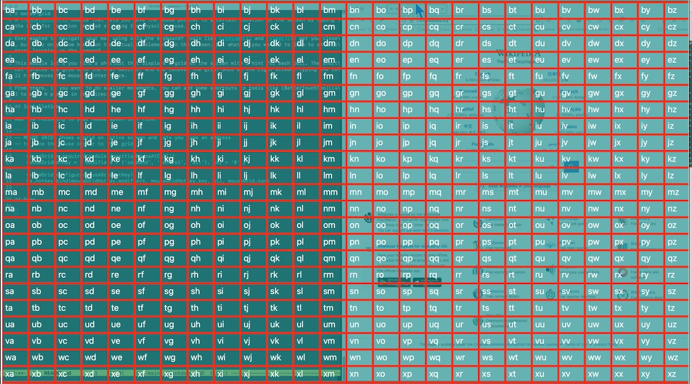

# mouse-grid
A [Hammerspoon][1] module that lets you move the mouse pointer to a certain location on the screen by typing the hint for location instead of using the physcial mouse. 

Ever wanted to navigate your mac using only the keyboard? Tools like [vimium][2] and [vimac][3] get you close, but they only show hints on the actual UI elements on the screen. But what if you wanted to jump to an arbitrary location on the screen?

This module let's you bind a shortcut that displays a grid on the screen with a hint for each cell. The same shortcut rotates the grid onto the next monitor, and ESC removes the grid. Once on the desired monitor/screen, typing the cell hint moves the mouse pointer there.



From there, if you want to do smaller movements, you can add some shortcuts to tools like [BetterTouchTool][4] to move N pixels in any direction. 

## Installation

Add the following to your Hammerspoon init file:

```
-- MOUSE GRID: Shows a grid on active screen and lets you type an address
-- to move the mouse cursor to that grid. 

    mouseGrid = require('modules/positionMouseAtCell')
    mouseGridHotKey = { modifiers = {'command', 'control', 'alt'}, key = '8' }

    mouseGrid.configure(mouseGridHotKey)
    hs.hotkey.bind(mouseGridHotKey.modifiers, mouseGridHotKey.key, nil, mouseGrid.run)
```

[1]: https://www.hammerspoon.org/
[2]: https://www.hammerspoon.org/
[3]: https://github.com/nchudleigh/vimac
[4]: https://folivora.ai/
